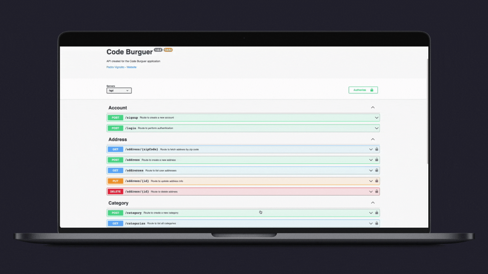

<h1 align="center">
    
</h1>

  <a href="#💻-project">Project</a>&nbsp;&nbsp;&nbsp;|&nbsp;&nbsp;
  <a href="#🎓-installation-and-execution">Installation and execution</a>

 

  

 

---

 

## 💻 &nbsp; Project

 

CodeBurger is a system created for a fast food, developed for study. with the objective of creating an API with a well-defined and decoupled architecture, using TDD as a working methodology, Clean Architecture to distribute responsibilities in layers, always following the principles of SOLID and whenever possible, applying Design Patterns to solve some common problems.

 

### Design Patterns

* Factory
* Adapter
* Composite
* Dependency Injection
* Composition Root
* Builder
* Template Method
* Singleton
* Chain of Responsibility
* Proxy

 

---

 

## 🎓 &nbsp; Installation and execution

 

01. Make a clone of this repository;
00. Enter the folder by running `cd CodeBurguer-Backend`;
00. Run `yarn` to install dependencies;
00. Rename the `.env.example` file to `.env`;
00. Put your credentials inside the `.env`;
00. Run `docker-compose-up` to start a container with the application;
00. Run `yarn typeorm migration:run` to run the migrations;
00. Go to `http://localhost:3333/api-docs/` to open the documentation;

 

---

 

### Made with ♥ by Pedro Vignotto |  [Contact](https://www.linkedin.com/in/pedro-vignotto/)
